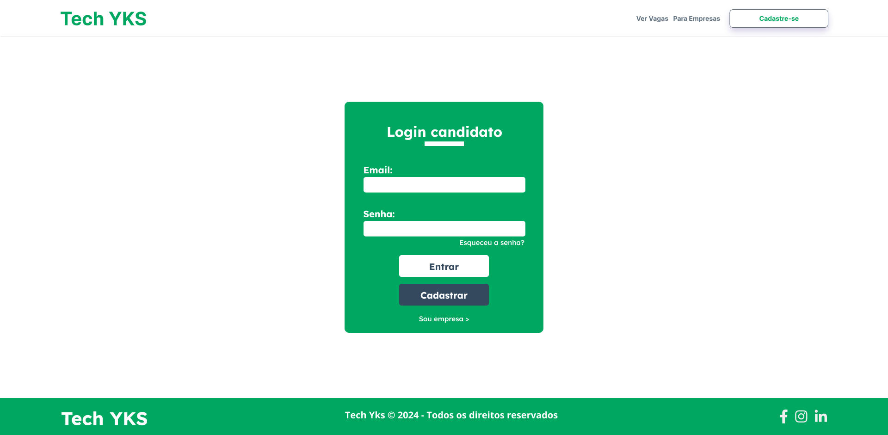
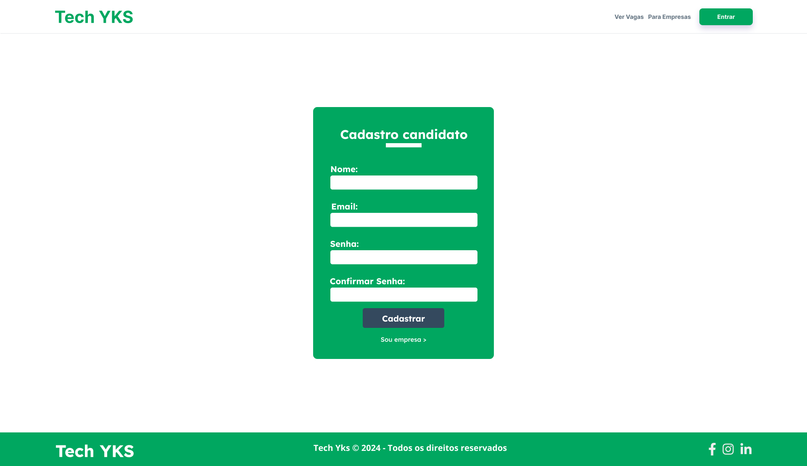
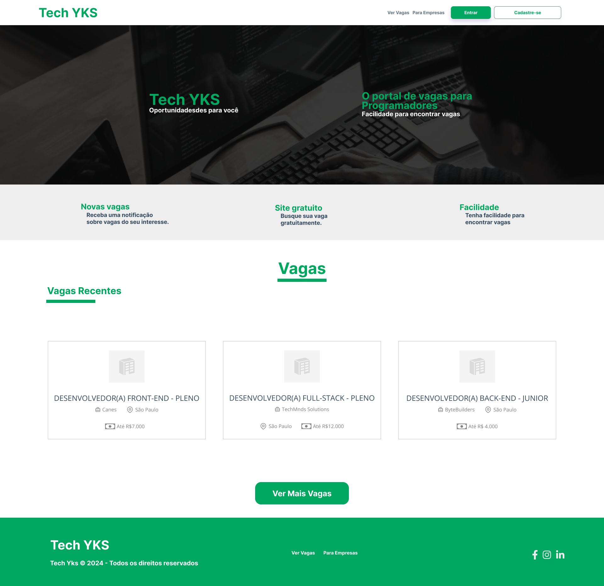
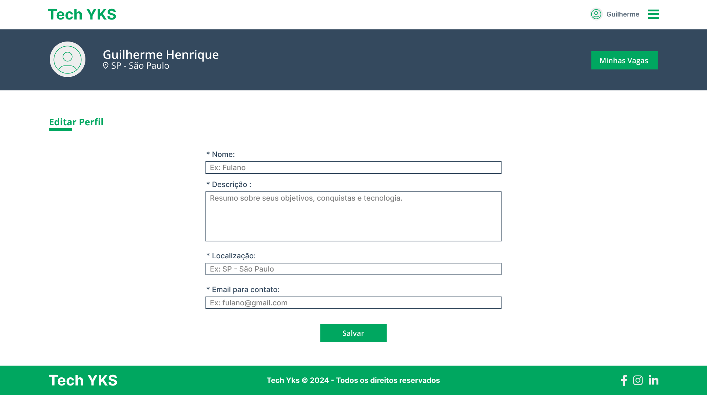
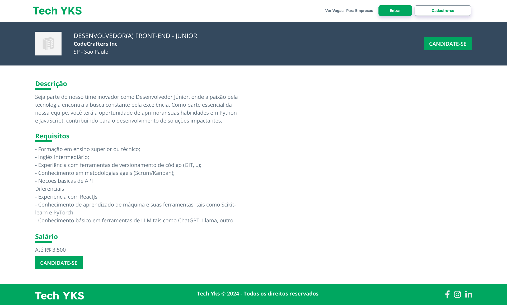
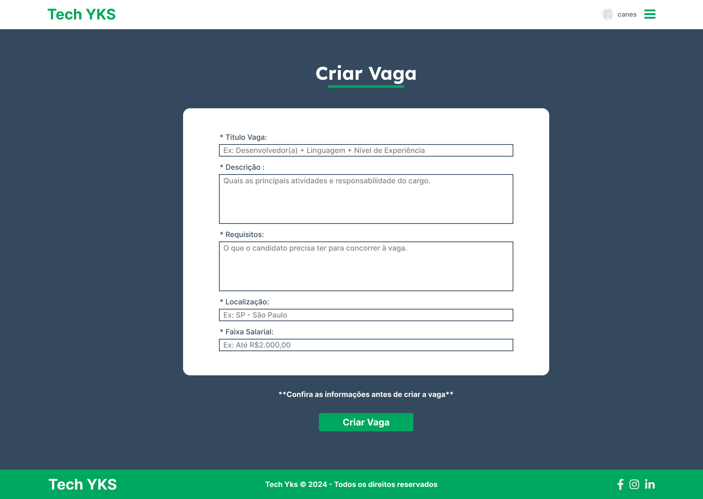
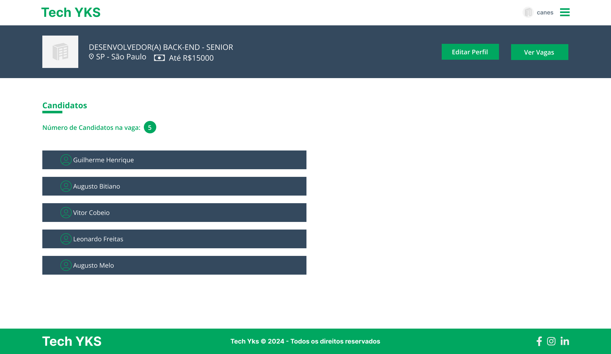

# Funcionalidades do Sistema de Vagas Para Tecnologia 

## Funcionalidades:

### Tela de Login:
- Email
- Senha
- Botão de Login
- Botão de Cadastro
- Botão de Esqueci minha senha

### Tela de Cadastro:
- Nome
- Email
- Senha
- Confirmação de Senha
- Botão de Cadastro

### Tela de Usuario Anônimo:
- Visualização de Vagas
- Botão de Cadastro
- Botão de Login
- Informações sobre o sistema

### Tela de Editar dados do Usuario:
- Nome
- Email
- Senha
- Confirmação de Senha
- Botão de Editar

### Tela de Informações da Vaga:
- Nome da Vaga
- Descrição da Vaga
- Requisitos da Vaga
- Salário
- Localização
- Botão de Candidatar

### Tela de Criação de Vaga:
- Nome da Vaga
- Descrição da Vaga
- Requisitos da Vaga
- Salário
- Localização
- Botão de Criação

### Tela de Lista de Candidatos:
- Visualizar candidatos

### Tela de Vagas Candidatadas:
- Visualizar Vagas Candidatadas

### Tela de Perfil da Empresa:
- Nome da Empresa
- Email da Empresa
- CNPJ
- Descrição da Empresa

### Tela de Vaga da Empresa:
- Visualizar Vagas abertas da empresa

### BR Modelo

## Grupo:
- Guilherme Henrique
- Vitor Cobeio
- Augusto Bitiano
- Leonardo Freitas
